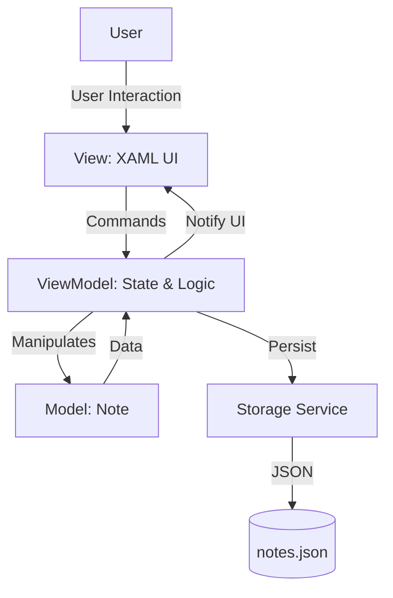

# To-Do List / Quick Notes (WPF)

Aplicación de escritorio desarrollada en **C# con WPF** que combina **notas rápidas** y **listas de tareas**, inspirada en aplicaciones de productividad minimalistas de Windows.

El objetivo del proyecto es **aprender y demostrar buenas prácticas** en desarrollo desktop moderno con **arquitectura MVVM**, binding reactivo y persistencia local.

> **Estado:** Proyecto en desarrollo activo

---

##  Características actuales

-  Gestión de notas (crear, seleccionar, eliminar)
-  Interfaz de escritorio moderna (WPF)
-  Arquitectura **MVVM**
-  Data Binding reactivo (`INotifyPropertyChanged`)
-  Colecciones observables (`ObservableCollection`)
-  Estilos centralizados en XAML
- Barra de título personalizada (WindowChrome)

---

##  En desarrollo / Roadmap

-  Buscador de notas en tiempo real
-  Checklist de tareas dentro de cada nota
-  Guardado local automático en JSON
-  Soporte de **Markdown** en el contenido
-  Vista previa Markdown
-  Respaldo en la nube (futuro)

---

##  Arquitectura

El proyecto sigue el patrón **MVVM (Model-View-ViewModel)**:

---

## Tecnologías utilizadas

- **Lenguaje:** C#
- **Framework:** .NET 10
- **UI:** WPF (Windows Presentation Foundation)
- **Arquitectura:** MVVM
- **Persistencia:** JSON (local)

---

